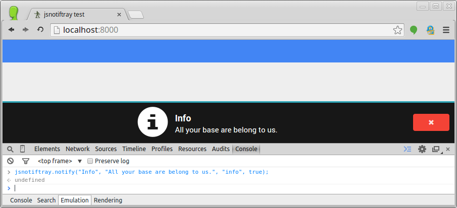
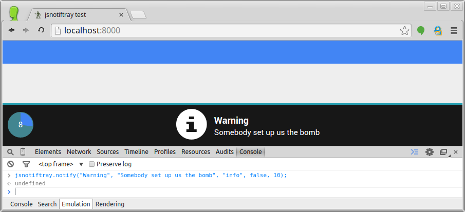
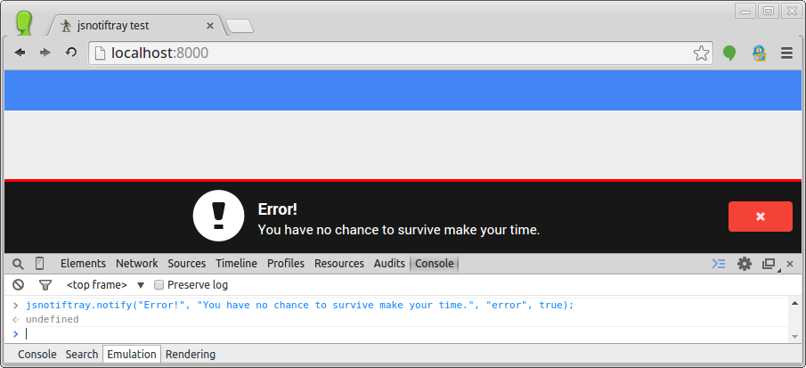

jsnotiftray
===========

A simple JavaScript notification in tray format

Currently requires bootstrap (references bootstrap icons)

Needs some love, as some things are hard-coded.

Usage:
```javascript
jsnotifytray.notify(<title>, <message>, <{info|warn|error}>, <close button {true|false}:optional>, <timeout:optional>)
```

example info:
```javascript
jsnotiftray.notify("Info", "All your base are belong to us.", "info", true);
```



example warning:
```javascript
jsnotiftray.notify("Warning", "Somebody set up us the bomb", "info", false, 10);
```



example error:
```javascript
jsnotiftray.notify("Error!", "You have no chance to survive make your time.", "error", true);
```




For great justice...
